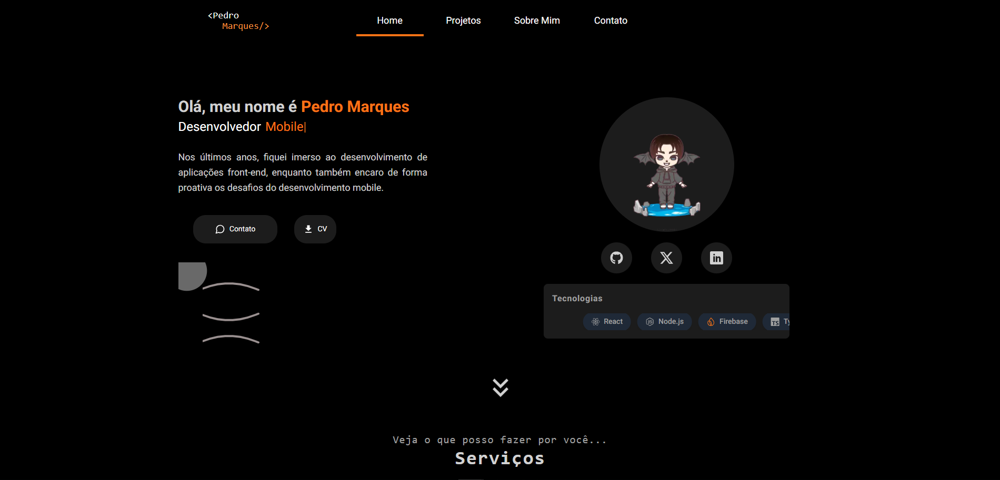

# **Portfólio - Pedro Marques**

Este é o meu portfólio atualizado, desenvolvido para destacar meus projetos e habilidades com um design moderno, responsivo e focado em performance.

## **Tecnologias Utilizadas**  
- **Frontend:** TailwindCSS, ReactJS, Next.js (v15)  
- **Animações:** Framer Motion  
- **Formulários:** React Hook Form com validação utilizando Zod  
- **Hospedagem:** Vercel  
- **SEO:** Configurações otimizadas para melhorar a indexação nos mecanismos de busca  

## **Recursos do Portfólio**  
- **Design Moderno e Responsivo:** Compatível com todos os dispositivos.  
- **Estrutura Bem Definida:**  
  - **Rotas:**  
    - **Home:** Introdução e apresentação.  
    - **About:** Minha trajetória e experiência.  
    - **Projects:** Projetos apresentados com **cards interativos**, que podem ser filtrados em **Web**, **Mobile** e **Automações**.  
    - **Contacts:** Formulário funcional e validado para facilitar o contato.  
- **Performance e Fluidez:** Foco em carregamento rápido e navegação suave.  

## **Preview**  
Acesse o site: **[pedromarques.dev.br](https://pedromarques.dev.br)**  

