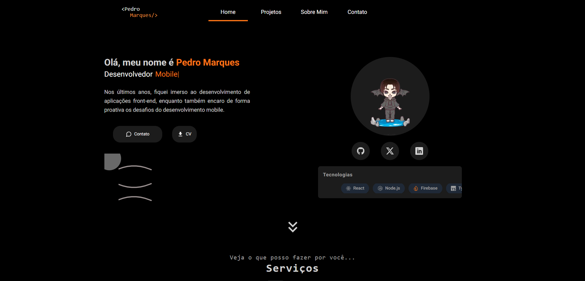

# **Bem Vindo**

Este é o meu portfólio atualizado, desenvolvido para destacar meus projetos e habilidades com um design moderno, responsivo e focado em performance.

## **Tecnologias Utilizadas**

- **Frontend:** TailwindCSS, ReactJS, Next.js (v15)
- **Animações:** Framer Motion
- **Formulários:** React Hook Form com validação utilizando Zod
- **Hospedagem:** Vercel, Railway
- **Banco de Dados:** MySQL
- **SEO:** Configurações otimizadas para melhorar a indexação nos mecanismos de busca
- **Inteligência Artificial:** Agente de IA construído com o Vercel AI SDK, integrado ao OpenRouter (Provider) para auxiliar os visitantes com informações dinâmicas.

## **Recursos do Portfólio**

- **Design Moderno e Responsivo:** Compatível com todos os tamanhos de tela e dispositivos.
- **Estrutura Bem Definida (Rotas):**
  - **Home:** Introdução e apresentação principal.
    - Apresentação de serviços oferecidos.
    - Call to Action (CTA) para entrar em contato.
    - Download do currículo atualizado.
  - **About:** Minha trajetória e experiência.
    - Apresentação detalhada sobre mim.
    - Stacks e tecnologias que utilizo no dia a dia.
  - **Projects:** Projetos apresentados com **cards interativos**.
    - Filtros por categoria (Web, Mobile, Automações e API) gerenciados via _Query Parameters_ na URL, mantendo o estado mesmo após recarregamentos (_page reloads_).
    - Paginação otimizada feita com React Query, buscando dados diretamente do banco MySQL e realizando _prefetch_ de dados em tempo real.
    - Dois modos de visualização (Grid e List), também controlados via URL.
  - **Contacts:** Formulário funcional e com validação para facilitar o contato.
- **Painel Administrativo (Admin Panel):**
  - Área restrita responsável pelo gerenciamento do portfólio (adição e remoção de projetos).
  - Login seguro realizando a verificação de hashes criptografados (usuário e senha).
  - Autenticação e controle de sessão gerenciados via JWT, salvo em cookies `HttpOnly` para maior segurança.
- **Performance e Fluidez:** Foco absoluto em carregamento rápido, SEO e navegação suave.

## **API e Backend**

O backend foi construído utilizando as **Route Handlers** (API Routes) do Next.js. Isso permite que a lógica de backend rode no mesmo processo e servidor do frontend, unificando o ecossistema.

### **Estrutura de Rotas (API)**

- `/auth` ➔ Responsável por gerenciar o login e a autenticação do painel admin.
- `/projects` ➔ Responsável pelo CRUD e listagem dos projetos.
- `/chat` ➔ Responsável por gerenciar as respostas do agente de IA.
  - Utiliza o Vercel AI SDK para orquestrar o streaming de texto.
  - Comunica-se com o provedor de modelos de linguagem através do OpenRouter.
- `/emails` ➔ Responsável pelo disparo de e-mails do formulário de contato utilizando Nodemailer.

## **Arquitetura**

A organização do código backend foi estruturada seguindo sólidos princípios de **Clean Architecture** e conceitos de **Arquitetura Hexagonal**, dividindo responsabilidades entre controladores, serviços e repositórios.

- **`/api/services`** ➔ Contém a camada de serviços responsável por toda a regra de negócio. Os serviços seguem o princípio de **Injeção de Dependência**, garantindo que não tenham conhecimento direto sobre a infraestrutura externa (ex: banco de dados).
- **`/api/repository`** ➔ Contém a camada responsável pela persistência e comunicação com o banco de dados (usando o SDK do `mysql2`).
  - _Detalhe:_ Essa separação é fundamental para que possamos trocar o banco de dados no futuro sem afetar as regras de negócio. As classes implementam interfaces que ditam os contratos estritos dos métodos que devem ser aplicados.

---

## 🔗 **Preview**

Acesse o site em produção: **[pedromarques.dev.br](https://pedromarques.dev.br)**
